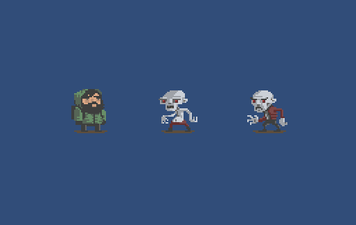
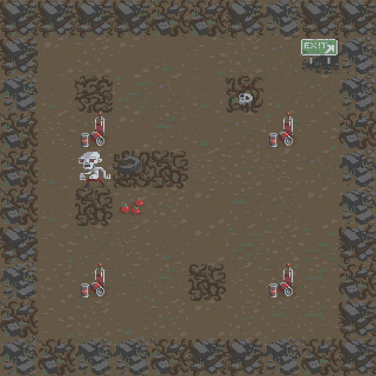
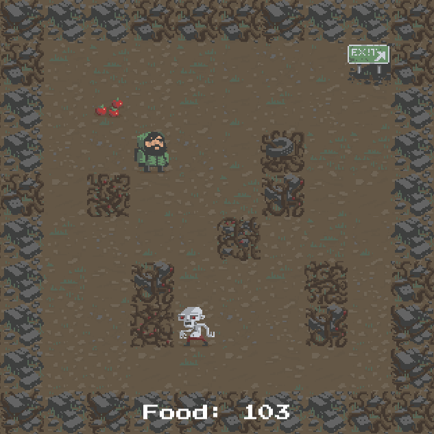

# beansjam_mobile

## [All-Night Polka in the Bayou](https://ndbiller.itch.io/all-night-polka-in-the-bayou)

A downloadable game for Android

An entry for the [Rocketbeans TV](https://www.rocketbeans.tv/) [BeansJam Mobile](https://itch.io/jam/beansjam) game jam 2018. Developed by [one person](https://ndbiller.github.io/portfolio/index.html) using mainly free software in 48 hours.

## DISCLAIMER:

**In it's current state please do not vote for this game in any form since there is almost no original content present so far.**
At the moment the game is still almost identical to the one offered [in the asset store](https://assetstore.unity.com/packages/essentials/tutorial-projects/2d-roguelike-29825) for free by Unity to help follow along with their [2D Roguelike tutorial](https://unity3d.com/de/learn/tutorials/s/2d-roguelike-tutorial). I will use the remaining time to individualise the game assets used for prototyping and will try to make something more original and Rocketbeans-related out of it.

## GAME:

**Story**: You are a travelling polka musician with a caravan of carnies. Your troupe arrives on the murky outskirts of New Orleans. Now you have to travel through the eerie swamps of the bayou to reach your final destination, looming gloomy in the distance. Can you escape the dangers of the swamp unscathed? Or will you succumb to the blues?

**Gameplay**: Fight against the cruel RNG gods of yesteryear and survive Permadeaths constant vicious attemts on claiming your hard-earned ever waning stash of rare eternal soul-stuff... like... in *that other game*. And all the stuff is randomly generated, for added replayability and more fun, the same way as in all those oldschool rouge-likes you so much enjoyed  when you were young. When playing as an *@* was still hip and training your little *d* to steal precious loot from those greedy shopkeepers for you was the bees knees (*Who's a good boy? Yes, you are! Yes! You! Are! Have this newt corpse as a treat... Yes! You git gud, Boy!*). Alas, nethack your way through hordes of bean-flavored foes and discover the true meaning of the blues. Completely captivating and hightly interactive, thanks to the innovative and slick state-of-the-art touch controls that your android device provides these days. And the highly original and captivating blues-and-polka-infused soundtrack extravaganza produced exclusively for this game by the hottest and most bestest public domain musicians I could find... Will. Rock. Your. World. 
Hard!

**Overwiew**: I will be Following some simple Unity tutorials, testing the 2D features of Unity (since I haven't been using Unity for quite some time now) while working with the included prototyping sprites from the tutorial available from the Unity asset store. Then I will switch them out along the way with some handmade pixel art and sprites inspired by the Rocketbeans guys and their work which I'll be creating in Aseprite. I'll add some more pictures telling a story, and thus working in the two required themes I have selected for this game from the three available ones: **Blues**, **Jahrmarkt** and **Dilemma**. Then I'll add some soundeffects and try to find a few polka-and-blues-inspired songs that complement the atmosphere and story of the project. In the end this will hopefully produce the 2D android rogue-like apk before the 48 hour timer hits zero. And finally, I'll try to document the necessary project steps and all the progress done here. Hopefully this'll show others how making games is fun and how this all can easily be be done by anyone if you just try.

### Install instructions

**Note**: The game is not yet scaling right to the android screen. The content of the game consists mostly of free assets from a unity tutorial, so the apk version is early alpha at best. 
**Please do not vote for the game in any form as long as it is still in this state.**

1. Download the apk file to your android device.
2. Alter your settings to allow apk installation from the required source.
3. Install the apk on your device.
4. Play the game.

### Download

[all_night_polka_in_the_bayou.apk](all_night_polka_in_the_bayou.apk) v0.2

### Screenshots

## TODO:

- [ ] set up android debugging
- [ ] fix android game resolution
- [ ] title screen
- [ ] story screens
- [ ] credits screen
- [ ] create custom sprites
- [ ] return to title screen from game over state
- [ ] make enemies mortal - *nice to have*
- [ ] more enemy sprites - *nice to have*
- [ ] different level biome tiles - *nice to have*
- [ ] implement different level biomes - *nice to have*

## CREDITS:

### Music

- polkamundo! by a.gorilly (c) copyright 2010 Licensed under a Creative Commons Attribution (3.0) license. http://dig.ccmixter.org/files/lillygorilly/29027 Ft: herkko, pingnews, Bitcrusher, illusivemind
- The Zombie Sings composed by C.P.Bryan provided by freesoundtrackmusic.com

### Tools and Ressources:

- Title and initial idea created using the awesome video game name generator: [https://videogamena.me/](https://videogamena.me/).
- Pixel art will be done using the fantastic pixel art graphic editor Aseprite: [https://www.aseprite.org/](https://www.aseprite.org/) \*
- Some of the graphics (like the screenshots for this page) will be done using the free paint tool paint.NET: [https://www.getpaint.net/](https://www.getpaint.net/)
- Prototyping, game development and the final programming will be done using the free personal edition of Unity 3D: [https://store.unity.com/download?ref=personal](https://store.unity.com/download?ref=personal)
- The code for the game in C# will be written using the fast, lightweight and versatile editor Sublime Text 3: [https://www.sublimetext.com/3](https://www.sublimetext.com/3) \*²
- The basics for the game are outlined in the following tutorial: [https://unity3d.com/de/learn/tutorials/s/2d-roguelike-tutorial](https://unity3d.com/de/learn/tutorials/s/2d-roguelike-tutorial)
- The prototyping assets for this tutorial are taken from the tutorials accompanying free asset pack in the unity asset store: [https://assetstore.unity.com/packages/essentials/tutorial-projects/2d-roguelike-29825](https://assetstore.unity.com/packages/essentials/tutorial-projects/2d-roguelike-29825)
  (these will later be replaced by my own handmade sprites)
- Mobile touch input implemented following the basic instructions in these unity mobile tutorials: [https://unity3d.com/de/learn/tutorials/topics/mobile-touch/multi-touch-input?playlist=17138](https://unity3d.com/de/learn/tutorials/topics/mobile-touch/multi-touch-input?playlist=17138)
- Testing the game on android and building the final apk was done following the instructions in this unity tutorial: [https://unity3d.com/de/learn/tutorials/topics/mobile-touch/building-your-unity-game-android-device-testing?playlist=17138](https://unity3d.com/de/learn/tutorials/topics/mobile-touch/building-your-unity-game-android-device-testing?playlist=17138)
- Version control, all the used assets of the game, the complete project code and all the unity project files are available for download in this public github repository of the project: [https://github.com/ndbiller/beansjam_mobile](https://github.com/ndbiller/beansjam_mobile) \*³

\* [Aseprite](https://www.aseprite.org/) is not for free but you can always download the source code directly [from their github repository](https://github.com/aseprite/aseprite/) and compile it on your computer for free, if you know how to do that.

\*² [Sublime Text 3](https://www.sublimetext.com/3) isn't free, but you can use this text editor without limitations. It will occasionally remind you while saving that you should buy a licence if you enjoy working with it.

\*³ You really should be using some kind of version control system like [github](https://github.com/).
