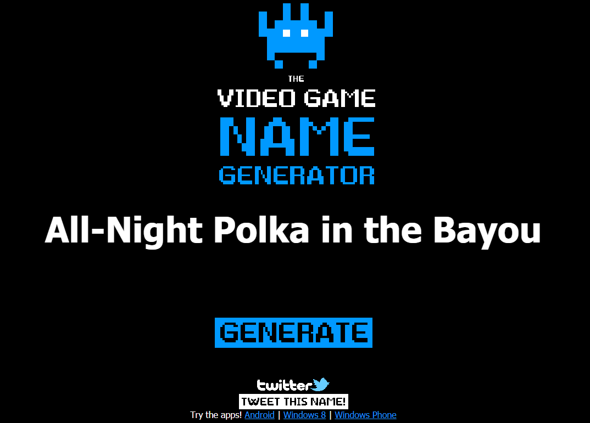

# beansjam_mobile

  An entry for the [Rocketbeans TV](https://www.rocketbeans.tv/) [BeansJam Mobile](https://itch.io/jam/beansjam) game jam in 2018.
  Done for fun in 48 hours.
  Original game jam entry page can be found on [itch.io](https://ndbiller.itch.io/all-night-polka-in-the-bayou):

## [All-Night Polka in the Bayou](https://ndbiller.itch.io/all-night-polka-in-the-bayou)

An entry for the [Rocketbeans TV](https://www.rocketbeans.tv/) [BeansJam Mobile](https://itch.io/jam/beansjam) game jam 2018. Developed by [one person](https://ndbiller.github.io/portfolio/index.html) using mainly free software in 48 hours.

**Story**: You are a struggling polka musician travelling with a caravan of carnie folk. Your troupe arrives on the murky outskirts of the birthplace of the blues, in New Orleans. Now you have to travel through the eerie swamps of the bayou to reach your final destination, the looming lair of evil located in the gloomy distance of the misty marsh landscape, dark and foreboding. Arriving at it's gates you can feel the gods pause for a moment in terror. It's in these walls where you will have to brave one final battle, deep in the bowels of this sinister southern estate you'll meet your fate, Count Budimon. Here you will have to prove your worth to the blues deities, here you will have to heed their call. Here you will prove the power of polka, you will appease a mad and crimson terror in the corner of this hall, here it will break or you will falter, here it will speak, lay out the present past and future, here you will show them that the polka is after all a worthy sonic weapon to be wielded, akin in power to the fabled might of blues. Can you atune the polka good enough to rival the power of these ancient melodies, as their fleeting echos of disharmonic harpsichords resonate growling through the dank and empty corridors and halls of the mansion? Will you survive your ethereal encounters within? Will you escape the unspeakable and alien architekture with your sanity intact? Many have tried to face this evil shadows gaze, have tried to leave these rooms where rotten lifeless husks convene. To fight those silent beings and their brooding ancient halls, only to let their own shrill screams of pain and death and terror mix with the cackling echoes of the damned. And so the endless drifting silence of this abysmal entity will drown the life and sound of everyone that dares traverse the precepice of this bewildered blue and polka dotted universe? You'll face the horror... the paisley horror of those halls... and they will haunt you! Will you manage to hold on? Or, as so many a one before you, will you unravel on this path? Despair and dread this very night! Or see the dawn again... and die? Or will you rage against the dead... against the dying of the light? How will you brave the final fight? And once you prove your worth, or might you... Harken, there is still room to fail, still ways to fall through... Will you be silent... or survive?

**Gameplay**: Fight against the cruel RNG gods of yesteryear and survive Permadeaths constant vicious attemts on claiming your hard-earned ever waning stash of rare eternal soul-stuff... like... in that other game. And all the stuff is randomly generated, for added replayability and more fun, the same way as in all those oldschool rouge-likes you so much enjoyed  when you were young. When playing as an *@* was still hip and training your little *d* to steal precious loot from those greedy shopkeepers for you was the bees knees (*Who's a good boy? Yes, you are! Yes! You! Are! Have this newt corpse as a treat... Yes! You git gud, Boy!*). Alas, nethack your way through hordes of bean-flavored foes and discover the true meaning of the blues. Completely captivating and hightly interactive, thanks to the innovative and slick state-of-the-art touch controls that your android device provides these days. And the highly original and captivating blues-and-polka-infused soundtrack extravaganza produced exclusively for this game by the hottest and most bestest public domain musicians I could find... Will. Rock. Your. World. 
Hard!

**Overwiew**: I will be Following some simple Unity tutorials, testing the 2D features of Unity (since I haven't been using Unity for quite some time now) while working with the included prototyping sprites from the tutorial available from the Unity asset store. Then I will switch them out along the way with some handmade pixel art and sprites inspired by the Rocketbeans guys and their work which I'll be creating in Aseprite. I'll add some more pictures telling a story, and thus working in the two required themes I have selected for this game from the three available ones: **Blues**, **Jahrmarkt** and **Dilemma**. Then I'll add some soundeffects and try to find a few polka-and-blues-inspired songs that complement the atmosphere and story of the project. In the end this will hopefully produce the 2D android rogue-like apk before the 48 hour timer hits zero. And finally, I'll try to document the necessary project steps and all the progress done here. Hopefully this'll show others how making games is fun and how this all can easily be be done by anyone if you just try.

### Tools and Ressources:
- Title and initial idea created using the awesome video game name generator: [https://videogamena.me/](https://videogamena.me/).
- Pixel art will be done using the fantastic pixel art graphic editor Aseprite: [https://www.aseprite.org/](https://www.aseprite.org/)\*
- Some of the graphics (like the screenshots for this page) will be done using the free paint tool paint.NET: [https://www.getpaint.net/](https://www.getpaint.net/)
- Prototyping, game development and the final programming will be done using the free personal edition of Unity 3D: [https://store.unity.com/download?ref=personal](https://store.unity.com/download?ref=personal)
- The code for the game in C# will be written using the fast, lightweight and versatile editor Sublime Text 3: [https://www.sublimetext.com/3](https://www.sublimetext.com/3)\*²
- The basics for the game are outlined in the following tutorial: [https://unity3d.com/de/learn/tutorials/s/2d-roguelike-tutorial](https://unity3d.com/de/learn/tutorials/s/2d-roguelike-tutorial)
- The prototyping assets for this tutorial are taken from the tutorials accompanying free asset pack in the unity asset store: [https://assetstore.unity.com/packages/essentials/tutorial-projects/2d-roguelike-29825](https://assetstore.unity.com/packages/essentials/tutorial-projects/2d-roguelike-29825)
  (these will later be replaced by my own handmade sprites)
- Mobile touch input implemented following the basic instructions in these unity mobile tutorials: [https://unity3d.com/de/learn/tutorials/topics/mobile-touch/multi-touch-input?playlist=17138](https://unity3d.com/de/learn/tutorials/topics/mobile-touch/multi-touch-input?playlist=17138)
- Testing the game on android and building the final apk was done following the instructions in this unity tutorial: [https://unity3d.com/de/learn/tutorials/topics/mobile-touch/building-your-unity-game-android-device-testing?playlist=17138](https://unity3d.com/de/learn/tutorials/topics/mobile-touch/building-your-unity-game-android-device-testing?playlist=17138)
- Version control, all the used assets of the game, the complete project code and all the unity project files are available for download in this public github repository of the project: [https://github.com/ndbiller/beansjam_mobile](https://github.com/ndbiller/beansjam_mobile)\*³

\* [Aseprite](https://www.aseprite.org/) is not for free and I bought it some time ago, because it is awesome and well worth the few bucks the developers charge you for it. But you can always download the source code of Aseprite directly [from their github repository](https://github.com/aseprite/aseprite/) and compile it on your computer for free, if you know how to do that and really don't want to pay any money for it now. I used to work with it for a long time in this way too, before finally deciding to buy it to support the devs.

\*² [Sublime Text 3](https://www.sublimetext.com/3) isn't free, but you can just use this awesome lightweight text editor and IDE withouth limitations for as long as you like. With all it's time-saving features and the available extensions, all it will occasionally do to remind you ever so often is popping up a reminder while saving that you should buy a licence if you enjoy and continue working with it. And one of these days I surely will. Not because the pop-ups are annoying (which they aren't), but solely because it's just that good.

\*³ Whatever you plan on doing in the field of game development, you really should learn how to use some kind of version control and code revision tool, like [github](https://github.com/). Just teaching yourself the basics of how to use a tool like github will be an invaluable skill all along your further way. Your github repository is basically where you will keep a backup of all your projects files, assets and code in a centrally hosted, easily accesible yet safe location for your team. It is how teams will be able to work on the same project files along with other people at the same time, where you will keep track of who changed what in the project while always being able to return to any previous versions of your assets or code. It is where you will keep track of your projects bugs and issues while working on fixing them, how you will organize your teams tasks and work and even plan your future features. With it you will be able to review newly written code and keep track of all the code changes, meassure your codes quality and it's complexity, even set up complicated continuous integration pipelines for your projects automated testing and product deployment needs with ease. And it's free for personal use.

### Install instructions
1. Download the apk file to your android device.
2. Alter your settings to allow apk installation from sources other than the google play store.
3. Install the apk on your device.
4. Play the game.

### Download
*no apk yet*
